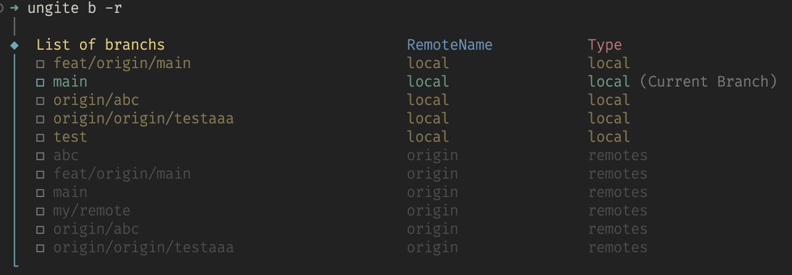

# ungite [](https://npmjs.com/package/ungite)

Git management Viewable.

## Features
- 🔥 Simple operation git flow.

## Usage
```shell
pnpm i -g ungite
```

```shell
ungite -h
```

### Branch

列出所有本地分支：

```shell
ungite b
```



#### Options
- 列出所有分支
- `-r` 列出所有分支 (包括远程分支)
- `-s` 切换目标分支
- `-d` 删除目标分支 (支持多选)

## License

[MIT](./LICENSE) License © 2023 [zyyv](https://github.com/zyyv)
